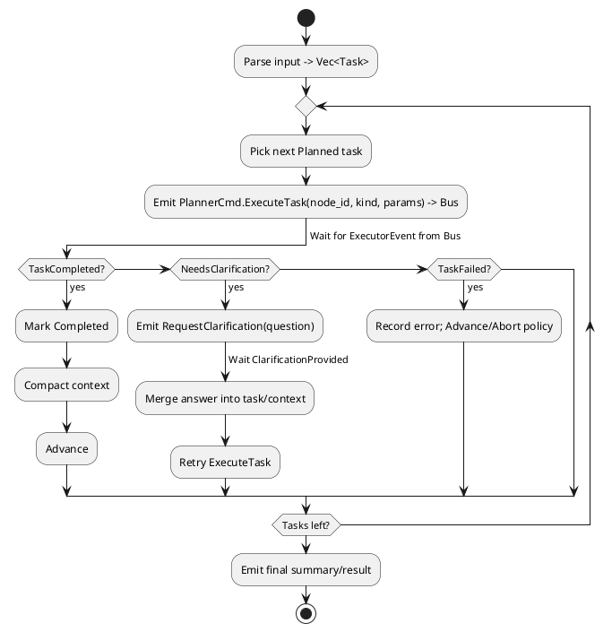

# Event-Sourced Planner — Implementation Design (meta_agent)

**Goal**: Build a clean, testable planner using the Handler trait pattern with event sourcing capabilities.

**Core Capabilities**:
- Parse plain text input into executable task sequence
- Execute tasks sequentially via command/event pattern
- Handle clarification requests with pause/resume semantics
- Compact context between steps to manage token limits
- Rebuild state from event log for reliability

**Key Principles**:
- Separation of business logic from infrastructure via Handler trait
- All state changes via domain events
- Clean command → event flow
- Deterministic replay from events via fold()
- Infrastructure-agnostic design

---

## 1) Architecture Overview

### Handler Trait Pattern
The planner implements a clean Handler trait that separates business logic from infrastructure:

**Core Handler Trait**:
```rust
pub trait Handler {
    type Command;
    type Event;
    type Error;

    fn process(&mut self, command: Self::Command) -> Result<Vec<Self::Event>, Self::Error>;
    fn fold(events: &[Self::Event]) -> Self;
}
```

**Commands** (Input to the planner):
```rust
pub enum Command {
    Initialize { user_input: String, attachments: Vec<Attachment> },
    HandleExecutorEvent(ExecutorEvent),
    Continue,
    CompactContext { max_tokens: usize },
}
```

**Events** (Output from the planner):
```rust
pub enum Event {
    TasksPlanned { tasks: Vec<TaskPlan> },
    TaskDispatched { task_id: u64, command: PlannerCmd },
    TaskStatusUpdated { task_id: u64, status: TaskStatus, result: Option<String> },
    ClarificationRequested { task_id: u64, question: String },
    ClarificationReceived { task_id: u64, answer: String },
    ContextCompacted { summary: String, removed_task_ids: Vec<u64> },
    PlanningCompleted { summary: String },
}
```

**Clean Separation**:
```
Commands → Planner.process() → Events
                ↓
         Internal State Update
                ↓
         Return Events to Caller
                
The caller (infrastructure) handles:
- Message bus publication
- Event persistence
- HTTP/gRPC transport
- Async coordination
```

**Event Sourcing via fold()**:
```rust
// Save events
let events = planner.process(command)?;
storage.append(&events);

// Later: Rebuild state
let historical_events = storage.load_all();
let planner = Planner::fold(&historical_events);
```

**Integration Flexibility**:
The planner can work with any infrastructure:
- Synchronous direct calls
- Async message buses (Kafka, Redis, RabbitMQ)
- HTTP/gRPC servers
- CLI applications
- Test harnesses

## 2) Public Interfaces & Data Types

> Integrate into `meta_draft/src/actors.rs` (or adjacent module). Enums below extend your existing pipeline types.

```rust
/// Commands emitted by the planner to the executor (published to bus).
pub enum PlannerCmd {
    ExecuteTask { node_id: u64, kind: NodeKind, parameters: String },
    RequestClarification { node_id: u64, question: String },
    // (Optional) Cancel/Abort, SaveCheckpoint, etc.
}

/// Events received by the planner from the executor/UI (consumed from bus).
pub enum ExecutorEvent {
    TaskCompleted { node_id: u64, result: String },
    TaskFailed { node_id: u64, error: String },
    NeedsClarification { node_id: u64, question: String },
    ClarificationProvided { node_id: u64, answer: String },
    // (Optional) CheckpointSaved, ToolOutput, etc.
}

/// Classification for routing & tooling (v1 minimal set)
#[derive(Debug, Clone, Copy)]
pub enum NodeKind {
    Clarification,   // explicit user Q/A
    ToolCall,        // external tool execution
    Processing,      // generic planning/analysis/implementation
}

#[derive(Debug, Clone, Copy, PartialEq, Eq)]
pub enum TaskStatus { Planned, Running, Completed, NeedsClarification }

// (Future)
#[derive(Debug, Clone)]
pub enum AttachmentKind {
    Link(String),        // URL
    ImageRef(String),    // URL or opaque id
    FileRef(String),     // path or opaque id
}

// (Future)
#[derive(Debug, Clone)]
pub struct Attachment {
    pub kind: AttachmentKind,
    pub label: Option<String>,
}

#[derive(Debug, Clone)]
pub struct Task {
    pub id: u64,
    pub description: String,       // plain text step
    pub kind: NodeKind,
    pub status: TaskStatus,
    pub attachments: Vec<Attachment>,
}

#[derive(Debug, Default)]
pub struct PlannerState {
    pub tasks: Vec<Task>,
    pub cursor: usize,
    pub waiting_for_clarification: bool,
    pub pending_clarification_for: Option<u64>,
    pub next_id: u64,
    pub context_summary: String, // compacted rolling summary
}
```

### Planner Implementation

```rust
pub struct PlannerConfig {
    pub system_prompt: String,
    pub profile: String,           // compaction profile
    pub token_budget: usize,       // max tokens for context
    pub error_char_limit: usize,   // max chars for error messages
}

pub struct Planner {
    state: PlannerState,
    event_log: Vec<Event>,  // For audit/debugging
}

impl Handler for Planner {
    type Command = Command;
    type Event = Event;
    type Error = PlannerError;
    
    fn process(&mut self, command: Command) -> Result<Vec<Event>, PlannerError> {
        // Process command, update state, emit events
    }
    
    fn fold(events: &[Event]) -> Self {
        // Rebuild state from events
    }
}
```

- The planner is pure business logic without infrastructure dependencies
- External components (LLM, Compactor) are accessed via the infrastructure layer
- State changes only through events for auditability

---

## 3) Control Flow

### Activity (PlantUML)


### Handler Implementation
```rust
impl Planner {
    /// Process commands and emit events
    fn process(&mut self, command: Command) -> Result<Vec<Event>, PlannerError> {
        let mut events = Vec::new();
        
        match command {
            Command::Initialize { user_input, attachments } => {
                // Parse input into tasks
                let tasks = self.parse_input(&user_input)?;
                events.push(Event::TasksPlanned { tasks });
                
                // Apply event and check for first task dispatch
                self.apply_event(&events[0]);
                
                if let Some(cmd) = self.generate_next_command() {
                    if let Some(task_id) = self.state.get_next_undispatched_task() {
                        events.push(Event::TaskDispatched {
                            task_id,
                            command: cmd,
                        });
                        self.apply_event(&events[1]);
                    }
                }
            }
            
            Command::HandleExecutorEvent(executor_event) => {
                match executor_event {
                    ExecutorEvent::TaskCompleted { node_id, result } => {
                        events.push(Event::TaskStatusUpdated {
                            task_id: node_id,
                            status: TaskStatus::Completed,
                            result: Some(result),
                        });
                        self.apply_event(&events[0]);
                        
                        // Dispatch next task or complete
                        if let Some(cmd) = self.generate_next_command() {
                            match cmd {
                                PlannerCmd::Complete { summary } => {
                                    events.push(Event::PlanningCompleted { summary });
                                }
                                _ => {
                                    if let Some(task_id) = self.state.get_next_undispatched_task() {
                                        events.push(Event::TaskDispatched {
                                            task_id,
                                            command: cmd,
                                        });
                                    }
                                }
                            }
                            if events.len() > 1 {
                                self.apply_event(&events[1]);
                            }
                        }
                    }
                    
                    ExecutorEvent::NeedsClarification { node_id, question } => {
                        events.push(Event::ClarificationRequested {
                            task_id: node_id,
                            question,
                        });
                        self.apply_event(&events[0]);
                    }
                    
                    ExecutorEvent::ClarificationProvided { node_id, answer } => {
                        events.push(Event::ClarificationReceived {
                            task_id: node_id,
                            answer,
                        });
                        self.apply_event(&events[0]);
                        
                        // Resume task execution
                        if let Some(cmd) = self.generate_next_command() {
                            events.push(Event::TaskDispatched {
                                task_id: node_id,
                                command: cmd,
                            });
                            self.apply_event(&events[1]);
                        }
                    }
                    
                    ExecutorEvent::TaskFailed { node_id, error } => {
                        events.push(Event::TaskStatusUpdated {
                            task_id: node_id,
                            status: TaskStatus::Failed,
                            result: Some(error),
                        });
                        self.apply_event(&events[0]);
                    }
                }
            }
            
            Command::Continue => {
                // Continue with next task
                if let Some(cmd) = self.generate_next_command() {
                    // Handle based on command type
                    // ... (similar to above)
                }
            }
            
            Command::CompactContext { max_tokens } => {
                let (summary, removed_ids) = self.compact_context(max_tokens);
                if !removed_ids.is_empty() {
                    events.push(Event::ContextCompacted {
                        summary,
                        removed_task_ids: removed_ids,
                    });
                    self.apply_event(&events[0]);
                }
            }
        }
        
        // Store events in log for debugging
        self.event_log.extend(events.clone());
        
        Ok(events)
    }
}
```

---

## 4) Planning & Attachments

**Parsing strategy (v1, deterministic):**
- Normalize input (trim, collapse whitespace), split into candidate steps by:
  - list bullets/numbered lines
  - sentence boundaries followed by connectors: "then", "next", "and then"
- Classify `NodeKind` with simple rules:
  - command/code/backtick patterns or tool verbs → `ToolCall`
  - explicit questions/ambiguity markers → `Clarification` (or use event flow)
  - otherwise → `Processing`
- Attachments: extract URLs via regex and associate as links; defer images/files.

**Context compaction (v1, no naive truncation):**
- Use a shared `Compactor` abstraction to merge the latest `result` into `context_summary` under a fixed budget.
- Compactor may use the planner's LLM and `system_prompt` to summarize salient details.
- Future prompts include `context_summary` + current task only.

---

## 5) Integration Points

The Handler trait enables flexible integration with any infrastructure:

### Direct Integration
```rust
// Simple synchronous usage
let mut planner = Planner::new();
let events = planner.process(Command::Initialize {
    user_input: "Analyze code and run tests".to_string(),
    attachments: vec![],
})?;

// Infrastructure handles events
for event in events {
    handle_event(event);
}
```

### Message Bus Integration
```rust
// Async with message bus
async fn handle_command(planner: Arc<Mutex<Planner>>, command: Command) {
    let mut planner = planner.lock().await;
    let events = planner.process(command).unwrap();
    
    for event in events {
        // Extract any commands to send
        if let Event::TaskDispatched { command, .. } = event {
            bus.publish("executor.commands", command).await;
        }
        // Store event
        event_store.append(event).await;
    }
}
```

### Event Sourcing Integration
```rust
// Rebuild from events
let historical_events = event_store.load_all().await;
let planner = Planner::fold(&historical_events);

// Continue from restored state
let events = planner.process(Command::Continue)?;
```

- Infrastructure maps `NodeKind` → suitable actor/tool (code agent, test runner, retriever, etc.)
- External services (LLM, Compactor) are injected via infrastructure layer
- All messaging concerns stay outside the planner's business logic

---

## 6) Error & Clarification Policy

- **NeedsClarification** pauses the loop; only resume on `ClarificationProvided`.
- Pause semantics: set `waiting_for_clarification = true` and `pending_clarification_for = Some(node_id)`; `step` returns early until an `ExecutorEvent::ClarificationProvided` is processed for that node.
- **TaskFailed** policy (v1): log, mark failed, continue; (later add retries/backoff).
- Validate attachments exist/accessible before dispatch; if not, ask for re-upload or alt link.

---

## 7) Minimal Example

**Input**: “Add login with session cookies. Use basic auth. Read API spec at https://example.com/spec.pdf. Then write unit tests.”

**Planned tasks** (example):
1. Processing — read spec and extract key constraints.  
2. Processing — backend login.  
3. Processing — frontend form & wiring.  
4. Processing — write and run tests.

If ambiguity (e.g., *cookie expiry?*), emit `RequestClarification` and wait.

---

## 8) Extensibility

See section 11 (Future Work) for planned extensions beyond v1.

---

## 9) Testing

- Unit: parse → tasks mapping; event handling transitions.
- Integration: scripted sequence (Completed → NeedsClarification → ClarificationProvided → Completed).
- Load: long task lists + compaction threshold respected.

---

## 10) Definition of Done

- Enums extended; planner compiles and is called on new input.
- Sequential loop executes tasks; clarification pause/resume works.
- Context compaction active; final summary emitted.
- Basic tests passing (unit + one integration path).

---

## 11) Scope: Not Now (v1)

- Advanced `NodeKind` variants (e.g., `UnitTest`, `Retrieval`, `Analysis`, `Refactor`, `CodeImplementation`).
- Non-URL attachments (image refs, file refs) and parsing of local files.
- Checkpointing, cancellation/abort flows, or persistence of planner state.
- Retries/backoff policies beyond simple log-and-advance on failure.
- Parallel or graph/DAG execution; v1 is strictly sequential.
- LLM-backed planning; v1 uses deterministic parsing heuristics.
- Long-term memory/vector store; v1 uses a rolling compact string summary.
- Rich metrics/telemetry; v1 may include minimal logging only.

---

## 12) Future Work

- Expand `NodeKind` as new tools/agents ship (e.g., `UnitTest`, `Retrieval`, `Analysis`, `Refactor`, `CodeImplementation`).
- Introduce `AttachmentKind` and `Attachment` handling for images and files.
- Add retry policies with caps/backoff and failure classification.
- Checkpoint/save/restore planner state and cancellation support.
- Optional parallelization or partial ordering once executors support it.
- Replace heuristic `plan_tasks` with an LLM-backed planner (same `Task` API).
- Upgrade `context_summary` to a vector store or structured memory.
- Add richer metrics, tracing, and UI affordances for clarifications.

---

## 12) Context Squeezing Integration

The planner integrates with the LLM-based context compaction utilities from `agent/utils.rs`:

### Available Compaction Functions

```rust
// From meta_agent/src/agent/utils.rs
pub async fn compact_error_message(
    llm: &dyn LLMClientDyn,
    model: &str,
    error_msg: &str,
    max_length: usize,
) -> Result<String>

pub async fn compact_thread(
    llm: &dyn LLMClientDyn,
    model: &str,
    thread: Vec<Message>,
    target_tokens: usize,
) -> Result<Vec<Message>>
```

### Integration in Planner

The planner uses these utilities for:

1. **Error Compaction**: When `TaskFailed` events contain verbose error messages
   - Preserves key error types, file paths, line numbers
   - Removes stack traces and repeated information
   - Targets configurable character limit

2. **Thread Compaction**: When conversation history exceeds token budget
   - Keeps user intent and current generation status
   - Summarizes or drops code snippets
   - Preserves essential context for understanding

3. **Context Summary Updates**: After each task completion
   ```rust
   async fn compact_context(&mut self, result: &str) -> Result<String> {
       // Use compact_thread for conversation context
       let compacted = compact_thread(
           &self.llm,
           &self.model,
           self.state.get_thread(),
           self.config.token_budget
       ).await?;
       
       // Store reference to compacted context
       let summary_ref = self.store_summary(compacted).await?;
       Ok(summary_ref)
   }
   ```

### Configuration

```rust
pub struct PlannerConfig {
    pub system_prompt: String,
    pub profile: String,           // "coding", "analysis", etc.
    pub token_budget: usize,        // Max tokens for context
    pub error_char_limit: usize,    // Max chars for error messages
}
```

### Usage Pattern

1. Each task result triggers compaction check
2. If context exceeds budget, invoke `compact_thread`
3. Store compacted version with reference
4. Emit `ContextCompacted` event with reference
5. Use compacted context for next task prompt

---


