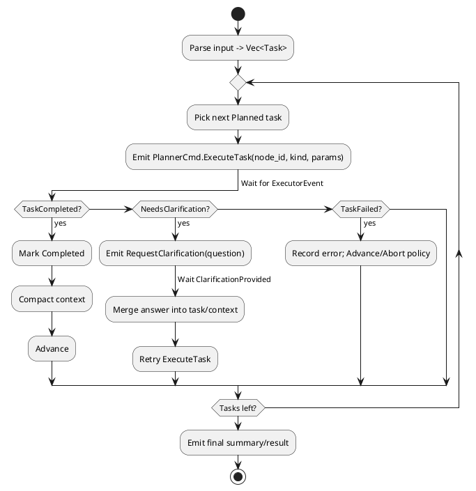

# Claude‑Style Planner — Design Doc (meta_agent / meta_draft)

**Goal**: A single-module, compile‑time integrated planner that:
- Accepts plain text input.
- (Future) Accepts links, image refs, and file attachments.
- Produces an ordered list of **text tasks** with attachment metadata.
- Drives execution via `PlannerCmd` → receives `ExecutorEvent`.
- Pauses for **user clarification** when needed, then resumes.
- **Compacts context** between steps to stay within token/memory limits.
- Runs a simple **sequential loop** until all tasks are done.

---

## 1) Public Interfaces & Data Types

> Integrate into `meta_draft/src/actors.rs` (or adjacent module). Enums below extend your existing pipeline types.

```rust
/// Commands emitted by the planner to the executor.
pub enum PlannerCmd {
    ExecuteTask { node_id: u64, kind: NodeKind, parameters: String },
    RequestClarification { node_id: u64, question: String },
    // (Optional) Cancel/Abort, SaveCheckpoint, etc.
}

/// Events received by the planner from the executor/UI.
pub enum ExecutorEvent {
    TaskCompleted { node_id: u64, result: String },
    TaskFailed { node_id: u64, error: String },
    NeedsClarification { node_id: u64, question: String },
    ClarificationProvided { node_id: u64, answer: String },
    // (Optional) CheckpointSaved, ToolOutput, etc.
}

/// Classification for routing & tooling (v1 minimal set)
#[derive(Debug, Clone, Copy)]
pub enum NodeKind {
    Clarification,   // explicit user Q/A
    ToolCall,        // external tool execution
    Processing,      // generic planning/analysis/implementation
}

#[derive(Debug, Clone, Copy, PartialEq, Eq)]
pub enum TaskStatus { Planned, Running, Completed, NeedsClarification }

// (Future)
#[derive(Debug, Clone)]
pub enum AttachmentKind {
    Link(String),        // URL
    ImageRef(String),    // URL or opaque id
    FileRef(String),     // path or opaque id
}

// (Future)
#[derive(Debug, Clone)]
pub struct Attachment {
    pub kind: AttachmentKind,
    pub label: Option<String>,
}

#[derive(Debug, Clone)]
pub struct Task {
    pub id: u64,
    pub description: String,       // plain text step
    pub kind: NodeKind,
    pub status: TaskStatus,
    pub attachments: Vec<Attachment>,
}

#[derive(Debug, Default)]
pub struct PlannerState {
    pub tasks: Vec<Task>,
    pub cursor: usize,
    pub waiting_for_clarification: bool,
    pub pending_clarification_for: Option<u64>,
    pub next_id: u64,
    pub context_summary: String, // compacted rolling summary
}
```

### Planner runtime composition (LLM & Compactor)

```rust
pub struct PlannerConfig {
    pub system_prompt: String,
}

pub struct Planner<L: LlmClient, C: Compactor> {
    pub state: PlannerState,
    pub llm: L,
    pub compactor: C,
    pub config: PlannerConfig,
}
```

- The planner owns its own LLM client and a Compactor instance.
- The Compactor is used to summarize/compact results into `context_summary` without naive truncation, respecting a token/character budget.

---

## 2) Control Flow

### Activity (PlantUML)


### Minimal Pseudocode (single `step` entrypoint)
```rust
impl PlannerState {
    pub fn plan_tasks(&mut self, input: &str, atts: &[Attachment]) {
        // 1) parse input → steps
        // 2) map steps → NodeKind
        // 3) v1: extract URLs only (files/images deferred)
        // 4) push Task { id: self.alloc_id(), ... }
    }

    /// Single entrypoint handling both incoming events and dispatching next work.
    pub fn step(&mut self, ctx: &mut Ctx, incoming: Option<ExecutorEvent>) {
        if let Some(evt) = incoming {
            match evt {
              ExecutorEvent::TaskCompleted { node_id, result } => {
                if let Some(t) = self.by_id_mut(node_id) {
                   t.status = TaskStatus::Completed;
                   self.compact_with(&result);
                   self.cursor += 1;
                }
              }
              ExecutorEvent::NeedsClarification { node_id, question } => {
                if let Some(t) = self.by_id_mut(node_id) {
                   t.status = TaskStatus::NeedsClarification;
                   self.waiting_for_clarification = true;
                   self.pending_clarification_for = Some(node_id);
                   ctx.emit(PlannerCmd::RequestClarification { node_id, question });
                }
              }
              ExecutorEvent::ClarificationProvided { node_id, answer } => {
                if let Some(t) = self.by_id_mut(node_id) {
                   t.status = TaskStatus::Planned;
                   t.description.push_str(&format!("\nClarification: {}", answer));
                   self.waiting_for_clarification = false;
                   self.pending_clarification_for = None;
                }
              }
              ExecutorEvent::TaskFailed { node_id: _, error: _ } => {
                // v1 policy: advance to next
                self.cursor += 1;
              }
              _ => {}
            }
        }

        if self.waiting_for_clarification { return; }
        if let Some(t) = self.tasks.get_mut(self.cursor) {
            if t.status == TaskStatus::Planned {
                t.status = TaskStatus::Running;
                ctx.emit(PlannerCmd::ExecuteTask {
                    node_id: t.id, kind: t.kind, parameters: t.description.clone()
                });
            }
        }
    }
}
```

---

## 3) Planning & Attachments

**Parsing strategy (v1, deterministic):**
- Normalize input (trim, collapse whitespace), split into candidate steps by:
  - list bullets/numbered lines
  - sentence boundaries followed by connectors: "then", "next", "and then"
- Classify `NodeKind` with simple rules:
  - command/code/backtick patterns or tool verbs → `ToolCall`
  - explicit questions/ambiguity markers → `Clarification` (or use event flow)
  - otherwise → `Processing`
- Attachments: extract URLs via regex and associate as links; defer images/files.

**Context compaction (v1, no naive truncation):**
- Use a shared `Compactor` abstraction to merge the latest `result` into `context_summary` under a fixed budget.
- Compactor may use the planner's LLM and `system_prompt` to summarize salient details.
- Future prompts include `context_summary` + current task only.

---

## 4) Integration Points

- Create `Planner` (with `PlannerState`, LLM, Compactor) inside `actors.rs` (or `planner.rs` re-exported).
- When new **user input** arrives: build `attachments`, call `plan_tasks`, then call `step(ctx, None)`.
- Route all `ExecutorEvent` instances to `PlannerState::step(ctx, Some(evt))`.
- Ensure executor maps `NodeKind` → suitable actor/tool (code agent, test runner, retriever, etc.).

---

## 5) Error & Clarification Policy

- **NeedsClarification** pauses the loop; only resume on `ClarificationProvided`.
- Pause semantics: set `waiting_for_clarification = true` and `pending_clarification_for = Some(node_id)`; `step` returns early until an `ExecutorEvent::ClarificationProvided` is processed for that node.
- **TaskFailed** policy (v1): log, mark failed, continue; (later add retries/backoff).
- Validate attachments exist/accessible before dispatch; if not, ask for re-upload or alt link.

---

## 6) Minimal Example

**Input**: “Add login with session cookies. Use basic auth. Read API spec at https://example.com/spec.pdf. Then write unit tests.”

**Planned tasks** (example):
1. Processing — read spec and extract key constraints.  
2. Processing — backend login.  
3. Processing — frontend form & wiring.  
4. Processing — write and run tests.

If ambiguity (e.g., *cookie expiry?*), emit `RequestClarification` and wait.

---

## 7) Extensibility

See section 11 (Future Work) for planned extensions beyond v1.

---

## 8) Testing

- Unit: parse → tasks mapping; event handling transitions.
- Integration: scripted sequence (Completed → NeedsClarification → ClarificationProvided → Completed).
- Load: long task lists + compaction threshold respected.

---

## 9) Definition of Done

- Enums extended; planner compiles and is called on new input.
- Sequential loop executes tasks; clarification pause/resume works.
- Context compaction active; final summary emitted.
- Basic tests passing (unit + one integration path).

---

## 10) Scope: Not Now (v1)

- Advanced `NodeKind` variants (e.g., `UnitTest`, `Retrieval`, `Analysis`, `Refactor`, `CodeImplementation`).
- Non-URL attachments (image refs, file refs) and parsing of local files.
- Checkpointing, cancellation/abort flows, or persistence of planner state.
- Retries/backoff policies beyond simple log-and-advance on failure.
- Parallel or graph/DAG execution; v1 is strictly sequential.
- LLM-backed planning; v1 uses deterministic parsing heuristics.
- Long-term memory/vector store; v1 uses a rolling compact string summary.
- Rich metrics/telemetry; v1 may include minimal logging only.

---

## 11) Future Work

- Expand `NodeKind` as new tools/agents ship (e.g., `UnitTest`, `Retrieval`, `Analysis`, `Refactor`, `CodeImplementation`).
- Introduce `AttachmentKind` and `Attachment` handling for images and files.
- Add retry policies with caps/backoff and failure classification.
- Checkpoint/save/restore planner state and cancellation support.
- Optional parallelization or partial ordering once executors support it.
- Replace heuristic `plan_tasks` with an LLM-backed planner (same `Task` API).
- Upgrade `context_summary` to a vector store or structured memory.
- Add richer metrics, tracing, and UI affordances for clarifications.
