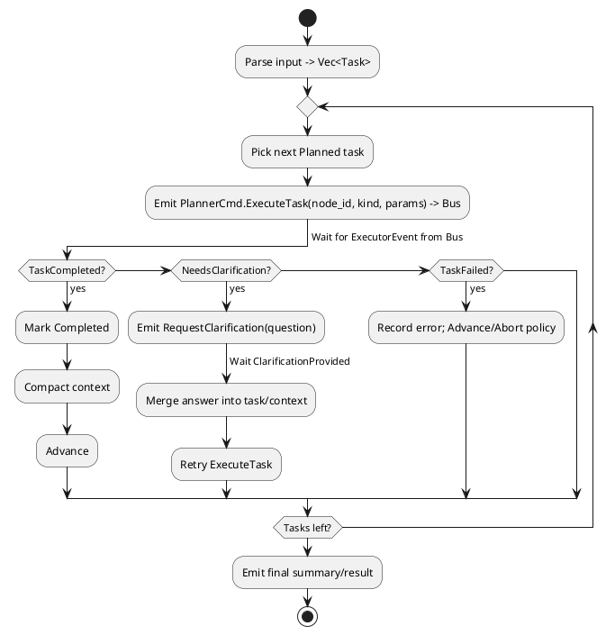

# Event-Sourced Planner — Implementation Design (meta_agent)

> **MVP NOTE**: See `meta_planner_design_MVP.md` for radical scope cut. This document contains the full vision.

**Goal**: Build a production-ready AI planner leveraging DabGent MQ's event sourcing infrastructure and the Handler trait pattern.

**Foundation**: DabGent MQ (`dabgent/dabgent_mq/`) provides the production event sourcing and messaging backbone that enables all our capabilities.

**Core Capabilities (Powered by DabGent MQ)**:
- Parse plain text input into executable task sequence
- Execute tasks via event-driven patterns using DabGent MQ's real-time subscriptions
- Handle clarification requests with pause/resume using event streams
- Compact context between steps with events tracking all transformations
- Rebuild state from DabGent MQ's persistent event log with full audit trail
- Scale horizontally via DabGent MQ's fan-out subscriptions

**Architectural Principles**:
- Handler trait for business logic + DabGent MQ for infrastructure
- All state changes via domain events persisted to DabGent MQ
- Event streams enable reactive executor coordination
- Deterministic replay from DabGent MQ's sequenced events via fold()
- Production-ready from day one with SQLite/PostgreSQL backends

---

## 1) Architecture Overview: Handler + DabGent MQ

### The Synergy: Clean Domain Logic Meets Production Infrastructure

Our architecture combines:
1. **Handler Trait**: Pure business logic with no infrastructure dependencies
2. **DabGent MQ**: Production event store with persistence, streaming, and metadata

**Core Handler Trait**:
```rust
pub trait Handler {
    type Command;
    type Event;  // Will implement dabgent_mq::models::Event
    type Error;

    fn process(&mut self, command: Self::Command) -> Result<Vec<Self::Event>, Self::Error>;
    fn fold(events: &[Self::Event]) -> Self;  // Reconstruct from DabGent MQ events
}
```

**DabGent MQ Integration**:
```rust
use dabgent_mq::db::{EventStore, sqlite::SqliteStore};
use dabgent_mq::models::{Event as MqEvent, Metadata};

// Our events implement DabGent MQ's Event trait
impl MqEvent for crate::planner::Event {
    const EVENT_VERSION: &'static str = "1.0";
    fn event_type(&self) -> &'static str { /* ... */ }
}
```

**Commands** (Input to the planner):
```rust
pub enum Command {
    Initialize { user_input: String, attachments: Vec<Attachment> },
    HandleExecutorEvent(ExecutorEvent),
    Continue,
    CompactContext { max_tokens: usize },
}
```

**Events** (Output from the planner):
```rust
pub enum Event {
    TasksPlanned { tasks: Vec<TaskPlan> },
    TaskDispatched { task_id: u64, command: PlannerCmd },
    TaskStatusUpdated { task_id: u64, status: TaskStatus, result: Option<String> },
    ClarificationRequested { task_id: u64, question: String },
    ClarificationReceived { task_id: u64, answer: String },
    ContextCompacted { summary: String, removed_task_ids: Vec<u64> },
    PlanningCompleted { summary: String },
}
```

**Architecture Flow with DabGent MQ**:
```
Commands → Planner.process() → Events
                ↓
         Internal State Update
                ↓
         DabGent MQ EventStore.push_event()
                ↓
         Real-time EventStream subscriptions
                ↓
    Executors receive events → Process tasks
                ↓
    Results flow back via events → Planner
```

**DabGent MQ Handles**:
- Event persistence with ACID guarantees
- Real-time streaming to subscribers
- Sequence tracking and deduplication
- Correlation/causation metadata
- Database migrations and schema evolution

**Event Sourcing with DabGent MQ**:
```rust
// Save events to DabGent MQ
let events = planner.process(command)?;
for event in events {
    store.push_event("planner", aggregate_id, &event, &metadata).await?;
}

// Later: Rebuild state from DabGent MQ
let query = Query { stream_id: "planner".into(), aggregate_id: Some(id), ..Default::default() };
let historical_events = store.load_events(&query, None).await?;
let planner = Planner::fold(&historical_events);

// Real-time subscriptions
let mut stream = store.subscribe::<Event>(&query)?;
while let Some(event) = stream.next().await {
    executor.handle(event?).await;
}
```

**Integration Patterns Enabled by DabGent MQ**:
- **Direct + Persistent**: Synchronous calls with event persistence
- **Streaming**: Real-time event subscriptions for reactive processing
- **Fan-out**: Multiple executors subscribing to same event stream
- **Replay**: Time-travel debugging via event history
- **Distributed**: Multi-service coordination via shared event store
- **Testing**: In-memory SQLite for fast, realistic tests

---

## 2) DabGent MQ: The Production Foundation

### Core Infrastructure Components

DabGent MQ provides the production infrastructure that makes our planner immediately deployable:

**Core Features That Enable Our Vision:**
- **Dual Database Support**: PostgreSQL and SQLite backends with automatic migrations - enables both local development and production scale
- **Event Sourcing**: Full audit trails with sequence tracking and metadata - perfect for debugging complex task sequences and replaying failed plans
- **Real-time Subscriptions**: Stream events with automatic polling and fan-out - enables reactive executor coordination and parallel task monitoring
- **Type Safety**: Strongly typed events with compile-time guarantees - ensures our complex event hierarchies remain maintainable
- **Concurrent Safe**: Built with async/await and proper locking - supports parallel task execution patterns we'll add in future phases
- **Performance**: Benchmarked throughput with various producer/consumer patterns - scales to handle enterprise-grade planning workloads

**Event Store API:**
```rust
pub trait EventStore: Clone + Send + Sync + 'static {
    async fn push_event<T: Event>(&self, stream_id: &str, aggregate_id: &str, event: &T, metadata: &Metadata) -> Result<(), Error>;
    async fn load_events<T: Event>(&self, query: &Query, sequence: Option<i64>) -> Result<Vec<T>, Error>;
    fn subscribe<T: Event>(&self, query: &Query) -> Result<EventStream<T>, Error>;
}
```

**Event Metadata:**
```rust
pub struct Metadata {
    pub correlation_id: Option<uuid::Uuid>,
    pub causation_id: Option<uuid::Uuid>,
    pub extra: Option<JsonValue>,
}
```

**Database Schema:**
```sql
CREATE TABLE events (
    stream_id TEXT NOT NULL,
    event_type TEXT NOT NULL,
    aggregate_id TEXT NOT NULL,
    sequence BIGINT NOT NULL,
    event_version TEXT NOT NULL,
    data JSONB NOT NULL,
    metadata JSONB NOT NULL,
    created_at TIMESTAMPTZ NOT NULL,
    PRIMARY KEY (stream_id, event_type, aggregate_id, sequence)
);
```

### Integration Architecture

**Event Persistence Layer**:

```rust
// Instead of our InMemoryEventStore
use dabgent_mq::db::{EventStore, sqlite::SqliteStore, Query};
use dabgent_mq::models::Event;

// Planner events implement the Event trait
impl Event for crate::planner::Event {
    const EVENT_VERSION: &'static str = "1.0";
    fn event_type() -> &'static str {
        match self {
            Event::TasksPlanned { .. } => "TasksPlanned",
            Event::TaskDispatched { .. } => "TaskDispatched",
            // ... other variants
        }
    }
}
```

**Event Metadata System**:

```rust
// Our current
pub struct EventMetadata {
    pub id: String,
    pub aggregate_id: String,
    pub timestamp: u64,
    // ...
}

// DabGent MQ provides
pub struct Metadata {
    pub correlation_id: Option<uuid::Uuid>,  // Trace across services
    pub causation_id: Option<uuid::Uuid>,    // What caused this event
    pub extra: Option<JsonValue>,            // Custom metadata
}
```

**Streaming Architecture**:

```rust
// Subscribe to planner events in real-time
let query = Query {
    stream_id: "planner-events".to_string(),
    event_type: Some("TaskDispatched".to_string()),
    aggregate_id: None,
};

let mut subscription = store.subscribe::<TaskDispatchedEvent>(&query)?;
while let Some(event) = subscription.next().await {
    // Handle task dispatch events as they occur
    executor.handle_task(event?).await;
}
```

### Planner-DabGent MQ Integration Points (Implemented)

**1. Event Definition**:
```rust
// src/planner/events_mq.rs
impl dabgent_mq::models::Event for planner::Event {
    const EVENT_VERSION: &'static str = "1.0";
    fn event_type(&self) -> &'static str { "PlannerEvent" }
}
```

**2. Direct Persistence (no adapter)**:
```rust
// example_usage.rs (behind feature = "mq")
let pool = sqlx::sqlite::SqlitePoolOptions::new()
    .max_connections(5)
    .connect("sqlite::memory:")
    .await?;
let store = SqliteStore::new(pool);
store.migrate().await;
store.push_event("planner", "session-1", &event, &Metadata::default()).await?;
```

**3. Subscriptions Validated in Tests**:
```rust
// tests/mq_subscribe_test.rs (feature = "mq")
let mut stream = store.subscribe::<Event>(&query)?;
let got = tokio::time::timeout(Duration::from_secs(3), async { stream.next().await }).await?;
```

**How DabGent MQ Enables Our Grand Vision:**

**Immediate Benefits:**
- **Production Ready**: Proven event store with migrations, transactions, and error handling - no need to build persistence layer
- **Scalable**: Benchmarked performance - ready for complex multi-agent orchestration
- **Observable**: Rich metadata for tracing - enables the metrics/telemetry we planned
- **Resilient**: Proper sequence tracking - supports checkpoint/restore features
- **Real-time**: Stream events as they occur - foundation for parallel execution patterns

**Future Features Enabled:**
- **Advanced NodeKind Routing**: EventStream subscriptions can route specialized tasks (`UnitTest`, `Retrieval`, `Analysis`) to specialized executors
- **Parallel Task Execution**: Fan-out pattern supports DAG execution when we're ready
- **Checkpoint/Restore**: Event sourcing provides natural checkpoint boundaries
- **Multi-Agent Coordination**: Shared event store enables complex agent interactions
- **Time-Travel Debugging**: Replay events to any point for debugging failed plans
- **A/B Testing**: Fork event streams to test different planning strategies

## 3) Public Interfaces & Data Types (DabGent MQ Compatible)

> Integrate into `meta_draft/src/actors.rs` (or adjacent module). Enums below extend your existing pipeline types.

```rust
/// Commands emitted by the planner to the executor (published to bus).
pub enum PlannerCmd {
    ExecuteTask { node_id: u64, kind: NodeKind, parameters: String },
    RequestClarification { node_id: u64, question: String },
    // (Optional) Cancel/Abort, SaveCheckpoint, etc.
}

/// Events received by the planner from the executor/UI (consumed from bus).
pub enum ExecutorEvent {
    TaskCompleted { node_id: u64, result: String },
    TaskFailed { node_id: u64, error: String },
    NeedsClarification { node_id: u64, question: String },
    ClarificationProvided { node_id: u64, answer: String },
    // (Optional) CheckpointSaved, ToolOutput, etc.
}

/// Classification for routing & tooling (v1 minimal set)
#[derive(Debug, Clone, Copy)]
pub enum NodeKind {
    Clarification,   // explicit user Q/A
    ToolCall,        // external tool execution
    Processing,      // generic planning/analysis/implementation
}

#[derive(Debug, Clone, Copy, PartialEq, Eq)]
pub enum TaskStatus { Planned, Running, Completed, NeedsClarification }

// (Future)
#[derive(Debug, Clone)]
pub enum AttachmentKind {
    Link(String),        // URL
    ImageRef(String),    // URL or opaque id
    FileRef(String),     // path or opaque id
}

// (Future)
#[derive(Debug, Clone)]
pub struct Attachment {
    pub kind: AttachmentKind,
    pub label: Option<String>,
}

#[derive(Debug, Clone)]
pub struct Task {
    pub id: u64,
    pub description: String,       // plain text step
    pub kind: NodeKind,
    pub status: TaskStatus,
    pub attachments: Vec<Attachment>,
}

#[derive(Debug, Default)]
pub struct PlannerState {
    pub tasks: Vec<Task>,
    pub cursor: usize,
    pub waiting_for_clarification: bool,
    pub pending_clarification_for: Option<u64>,
    pub next_id: u64,
    pub context_summary: String, // compacted rolling summary
}
```

### Planner Implementation

```rust
pub struct PlannerConfig {
    pub system_prompt: String,
    pub profile: String,           // compaction profile
    pub token_budget: usize,       // max tokens for context
    pub error_char_limit: usize,   // max chars for error messages
}

pub struct Planner {
    state: PlannerState,
    event_log: Vec<Event>,  // For audit/debugging
}

impl Handler for Planner {
    type Command = Command;
    type Event = Event;
    type Error = PlannerError;
    
    fn process(&mut self, command: Command) -> Result<Vec<Event>, PlannerError> {
        // Process command, update state, emit events
    }
    
    fn fold(events: &[Event]) -> Self {
        // Rebuild state from events
    }
}
```

- The planner is pure business logic without infrastructure dependencies
- External components (LLM, Compactor) are accessed via the infrastructure layer
- State changes only through events for auditability

---

## 4) Control Flow with Event Streaming

### Activity (PlantUML)


### Handler Implementation
```rust
impl Planner {
    /// Process commands and emit events
    fn process(&mut self, command: Command) -> Result<Vec<Event>, PlannerError> {
        let mut events = Vec::new();
        
        match command {
            Command::Initialize { user_input, attachments } => {
                // Parse input into tasks
                let tasks = self.parse_input(&user_input)?;
                events.push(Event::TasksPlanned { tasks });
                
                // Apply event and check for first task dispatch
                self.apply_event(&events[0]);
                
                if let Some(cmd) = self.generate_next_command() {
                    if let Some(task_id) = self.state.get_next_undispatched_task() {
                        events.push(Event::TaskDispatched {
                            task_id,
                            command: cmd,
                        });
                        self.apply_event(&events[1]);
                    }
                }
            }
            
            Command::HandleExecutorEvent(executor_event) => {
                match executor_event {
                    ExecutorEvent::TaskCompleted { node_id, result } => {
                        events.push(Event::TaskStatusUpdated {
                            task_id: node_id,
                            status: TaskStatus::Completed,
                            result: Some(result),
                        });
                        self.apply_event(&events[0]);
                        
                        // Dispatch next task or complete
                        if let Some(cmd) = self.generate_next_command() {
                            match cmd {
                                PlannerCmd::Complete { summary } => {
                                    events.push(Event::PlanningCompleted { summary });
                                }
                                _ => {
                                    if let Some(task_id) = self.state.get_next_undispatched_task() {
                                        events.push(Event::TaskDispatched {
                                            task_id,
                                            command: cmd,
                                        });
                                    }
                                }
                            }
                            if events.len() > 1 {
                                self.apply_event(&events[1]);
                            }
                        }
                    }
                    
                    ExecutorEvent::NeedsClarification { node_id, question } => {
                        events.push(Event::ClarificationRequested {
                            task_id: node_id,
                            question,
                        });
                        self.apply_event(&events[0]);
                    }
                    
                    ExecutorEvent::ClarificationProvided { node_id, answer } => {
                        events.push(Event::ClarificationReceived {
                            task_id: node_id,
                            answer,
                        });
                        self.apply_event(&events[0]);
                        
                        // Resume task execution
                        if let Some(cmd) = self.generate_next_command() {
                            events.push(Event::TaskDispatched {
                                task_id: node_id,
                                command: cmd,
                            });
                            self.apply_event(&events[1]);
                        }
                    }
                    
                    ExecutorEvent::TaskFailed { node_id, error } => {
                        events.push(Event::TaskStatusUpdated {
                            task_id: node_id,
                            status: TaskStatus::Failed,
                            result: Some(error),
                        });
                        self.apply_event(&events[0]);
                    }
                }
            }
            
            Command::Continue => {
                // Continue with next task
                if let Some(cmd) = self.generate_next_command() {
                    // Handle based on command type
                    // ... (similar to above)
                }
            }
            
            Command::CompactContext { max_tokens } => {
                let (summary, removed_ids) = self.compact_context(max_tokens);
                if !removed_ids.is_empty() {
                    events.push(Event::ContextCompacted {
                        summary,
                        removed_task_ids: removed_ids,
                    });
                    self.apply_event(&events[0]);
                }
            }
        }
        
        // Store events in log for debugging
        self.event_log.extend(events.clone());
        
        Ok(events)
    }
}
```

---

## 5) Planning & Attachments (Event-Driven)

**Parsing strategy (v1, deterministic):**
- Normalize input (trim, collapse whitespace), split into candidate steps by:
  - list bullets/numbered lines
  - sentence boundaries followed by connectors: "then", "next", "and then"
- Classify `NodeKind` with simple rules:
  - command/code/backtick patterns or tool verbs → `ToolCall`
  - explicit questions/ambiguity markers → `Clarification` (or use event flow)
  - otherwise → `Processing`
- Attachments: extract URLs via regex and associate as links; defer images/files.

**Context compaction (v1, no naive truncation):**
- Use a shared `Compactor` abstraction to merge the latest `result` into `context_summary` under a fixed budget.
- Compactor may use the planner's LLM and `system_prompt` to summarize salient details.
- Future prompts include `context_summary` + current task only.

---

## 6) Integration Points Leveraging DabGent MQ

The Handler trait enables flexible integration with any infrastructure:

### Direct Integration with Persistence
```rust
// Synchronous with DabGent MQ persistence
let store = SqliteStore::new("planner.db").await?;
let mut planner = Planner::new();
let events = planner.process(Command::Initialize {
    user_input: "Analyze code and run tests".to_string(),
    attachments: vec![],
})?;

// Persist events to DabGent MQ
for event in events {
    store.push_event("planner", session_id, &event, &metadata).await?;
    // Also trigger any real-time subscribers
}
```

### Reactive Event-Driven Integration
```rust
// Event-driven with DabGent MQ streaming
async fn handle_command(planner: Arc<Mutex<Planner>>, store: PlannerStore, command: Command) {
    let mut planner = planner.lock().await;
    let events = planner.process(command).unwrap();
    
    // Persist and stream events
    for event in events {
        // Store with rich metadata
        let metadata = Metadata {
            correlation_id: Some(session_id),
            causation_id: Some(command_id),
            extra: None,
        };
        store.push_event(&event, &metadata).await?;
        // DabGent MQ automatically notifies all subscribers
    }
}

// Executors subscribe to relevant events
tokio::spawn(async {
    let mut stream = store.subscribe_task_dispatched().await?;
    while let Some(event) = stream.next().await {
        executor.process_task(event).await;
    }
});
```

### Event Sourcing with DabGent MQ
```rust
// Rebuild from DabGent MQ event history
let query = Query {
    stream_id: "planner".to_string(),
    aggregate_id: Some(session_id.to_string()),
    event_type: None,
};
let historical_events = store.load_events::<Event>(&query, None).await?;
let planner = Planner::fold(&historical_events);

// Continue from restored state
let events = planner.process(Command::Continue)?;

// Time-travel debugging
let events_until = store.load_events(&query, Some(sequence_num)).await?;
let past_state = Planner::fold(&events_until);
```

- Infrastructure maps `NodeKind` → suitable actor/tool (code agent, test runner, retriever, etc.)
- External services (LLM, Compactor) are injected via infrastructure layer
- All messaging concerns stay outside the planner's business logic

---

## 7) Error & Clarification Policy (Event-Based)

- **NeedsClarification** pauses the loop; only resume on `ClarificationProvided`.
- Pause semantics: set `waiting_for_clarification = true` and `pending_clarification_for = Some(node_id)`; `step` returns early until an `ExecutorEvent::ClarificationProvided` is processed for that node.
- **TaskFailed** policy (v1): log, mark failed, continue; (later add retries/backoff).
- Validate attachments exist/accessible before dispatch; if not, ask for re-upload or alt link.

---

## 8) Minimal Example with DabGent MQ

**Input**: “Add login with session cookies. Use basic auth. Read API spec at https://example.com/spec.pdf. Then write unit tests.”

**Planned tasks** (example):
1. Processing — read spec and extract key constraints.  
2. Processing — backend login.  
3. Processing — frontend form & wiring.  
4. Processing — write and run tests.

If ambiguity (e.g., *cookie expiry?*), emit `RequestClarification` and wait.

---

## 9) Extensibility via Event Patterns

See section 11 (Future Work) for planned extensions beyond v1.

---

## 10) Testing with DabGent MQ

- **Unit Tests**: Parse → tasks mapping; event handling transitions
- **Integration Tests with DabGent MQ**: 
  ```rust
  #[tokio::test]
  async fn test_with_dabgent_mq() {
      let store = SqliteStore::in_memory().await.unwrap();
      // Test full flow with real persistence
  }
  ```
- **Event Replay Tests**: Verify fold() with DabGent MQ events
- **Load Tests**: Long task lists with DabGent MQ's benchmarked throughput

---

## 11) Definition of Done

- Planner events implement `dabgent_mq::models::Event` trait
- Events persist to DabGent MQ SQLite/PostgreSQL store
- State reconstructs correctly from DabGent MQ event history
- Event subscriptions deliver TaskDispatched to executors
- Integration tests pass with real DabGent MQ database
- Clarification pause/resume works via event streams
- Context compaction tracked via ContextCompacted events

---

## 12) Roadmap: Building on DabGent MQ Foundation

### Phase 1 (Current) - Core Handler + DabGent MQ Integration
- ✅ Basic Handler trait implementation
- ✅ Simple NodeKind variants (`Clarification`, `ToolCall`, `Processing`)
- 🚧 **DabGent MQ Integration** (This Week):
  - [ ] Implement `dabgent_mq::models::Event` for planner events
  - [ ] Create PlannerStore wrapping SqliteStore
  - [ ] Enable event subscriptions for executors
  - [ ] Add correlation/causation metadata
- 🚧 Event sourcing with DabGent MQ persistence

### Phase 2 (Next Quarter) - Enhanced Capabilities
- **Advanced NodeKind variants**: `UnitTest`, `Retrieval`, `Analysis`, `Refactor`, `CodeImplementation`
  - DabGent MQ subscriptions will route each type to specialized executors
- **Rich Attachments**: Beyond URLs to image/file references
  - Store attachment metadata in DabGent MQ's `extra` field
- **LLM-Backed Planning**: Replace heuristic parser
  - Use LLM to understand dependencies and optimal task ordering

### Phase 3 (6 Months) - Production Features
- **Checkpoint/Restore**: Natural boundaries via event sequences
  - DabGent MQ's sequence tracking provides checkpoint markers
- **Retry Policies**: Exponential backoff with circuit breakers
  - Track retry attempts in event metadata
- **Cancellation/Abort**: Graceful task interruption
  - Emit cancellation events, executors subscribe and respond

### Phase 4 (Year 1) - Advanced Architecture
- **Parallel/DAG Execution**: Task dependency graphs
  - DabGent MQ fan-out enables parallel task dispatch
  - Track dependencies in event metadata
- **Long-term Memory**: Vector store integration
  - Index completed tasks for similarity search
  - Store embeddings alongside events
- **Rich Telemetry**: Comprehensive observability
  - DabGent MQ metadata enables distributed tracing
  - Correlation IDs track request flow across services

---

## 13) The Grand Vision: AI Platform on DabGent MQ

### Near-Term Extensions (Enabled by DabGent MQ)

**Specialized Task Types** (via EventStream routing):
- `NodeKind::UnitTest` → Test runner executor
- `NodeKind::Retrieval` → RAG pipeline executor
- `NodeKind::Analysis` → Code analysis executor
- `NodeKind::Refactor` → AST manipulation executor
- `NodeKind::CodeImplementation` → Code generation executor

**Rich Media Handling**:
```rust
enum AttachmentKind {
    Link(String),              // URLs
    ImageRef(String),          // Vision model inputs
    FileRef(String),           // Code files, docs
    EmbeddingRef(String),      // Vector store references
    ScreenshotRef(String),     // UI testing artifacts
}
```

**Advanced Error Recovery**:
- Classification of failure types (transient, permanent, user-fixable)
- Exponential backoff with jitter
- Circuit breaker patterns
- Automatic rollback via event replay

### Long-Term Vision (The Platform)

**Distributed Planning**:
- Multiple planners collaborating via shared event store
- Hierarchical planning (meta-planner → sub-planners)
- Cross-team task coordination
- Global optimization of resource usage

**Intelligent Memory Systems**:
- Vector store for semantic task similarity
- Graph database for dependency tracking
- Time-series DB for performance metrics
- Knowledge graph of completed tasks

**Developer Experience**:
- Real-time UI showing task progress
- Interactive clarification dialogs
- Time-travel debugging interface
- Performance profiling dashboards
- Task template marketplace

**AI-Assisted Planning**:
- Learn from successful task sequences
- Predict likely clarification points
- Suggest optimal task ordering
- Auto-generate test cases
- Identify reusable sub-plans

### The Ultimate Goal

Create a self-improving AI development system where:
1. **Planning becomes smarter** through event analysis
2. **Executors become more capable** through specialization
3. **Failures become learning opportunities** through replay
4. **Patterns become reusable templates** through extraction
5. **Teams collaborate** through shared event streams

DabGent MQ provides the foundation for all of this - we just need to build on top of it.

---

## 14) Context Squeezing Integration

The planner integrates with the LLM-based context compaction utilities from `agent/utils.rs`:

### Available Compaction Functions

```rust
// From meta_agent/src/agent/utils.rs
pub async fn compact_error_message(
    llm: &dyn LLMClientDyn,
    model: &str,
    error_msg: &str,
    max_length: usize,
) -> Result<String>

pub async fn compact_thread(
    llm: &dyn LLMClientDyn,
    model: &str,
    thread: Vec<Message>,
    target_tokens: usize,
) -> Result<Vec<Message>>
```

### Integration in Planner

The planner uses these utilities for:

1. **Error Compaction**: When `TaskFailed` events contain verbose error messages
   - Preserves key error types, file paths, line numbers
   - Removes stack traces and repeated information
   - Targets configurable character limit

2. **Thread Compaction**: When conversation history exceeds token budget
   - Keeps user intent and current generation status
   - Summarizes or drops code snippets
   - Preserves essential context for understanding

3. **Context Summary Updates**: After each task completion
   ```rust
   async fn compact_context(&mut self, result: &str) -> Result<String> {
       // Use compact_thread for conversation context
       let compacted = compact_thread(
           &self.llm,
           &self.model,
           self.state.get_thread(),
           self.config.token_budget
       ).await?;
       
       // Store reference to compacted context
       let summary_ref = self.store_summary(compacted).await?;
       Ok(summary_ref)
   }
   ```

### Configuration

```rust
pub struct PlannerConfig {
    pub system_prompt: String,
    pub profile: String,           // "coding", "analysis", etc.
    pub token_budget: usize,        // Max tokens for context
    pub error_char_limit: usize,    // Max chars for error messages
}
```

### Usage Pattern

1. Each task result triggers compaction check
2. If context exceeds budget, invoke `compact_thread`
3. Store compacted version with reference
4. Emit `ContextCompacted` event with reference
5. Use compacted context for next task prompt

---


## Phase 3 Implementation Status: LLM Intelligence Layer ✅ COMPLETED

**Modules Created**:
- `src/planner/llm.rs` - Core LLM integration for task parsing
- `src/planner/llm_handler.rs` - LLM-enhanced planner implementation

**Capabilities Implemented**:

### 1. Natural Language Task Parsing
```rust
pub async fn parse_tasks(&self, user_input: &str) -> Result<Vec<ParsedTask>>
```
- Converts natural language into structured task sequences
- Uses XML-based output format for reliable parsing
- Extracts attachments (URLs, file references) from descriptions

### 2. Intelligent Task Classification
```rust
pub async fn classify_node_kind(&self, task_description: &str) -> Result<NodeKind>
```
- Semantic classification into Processing, ToolCall, or Clarification
- Context-aware understanding vs. simple keyword matching

### 3. Dependency Analysis
```rust
pub async fn analyze_dependencies(&self, tasks: &[ParsedTask]) -> Result<DependencyAnalysis>
```
- Identifies task interdependencies
- Suggests parallel execution groups
- Finds critical path and bottlenecks

### 4. Context Compaction with LLM
```rust
pub async fn compact_context(&self, events: &[Event], token_budget: usize) -> Result<String>
```
- Intelligently summarizes execution history
- Preserves critical decision points and results
- Optimizes token usage for continued planning

**Integration with Handler Pattern**:
- `LLMEnhancedPlanner` wraps base `Planner`
- Maintains Handler trait compatibility
- Graceful fallback to basic parsing if LLM unavailable
- Async methods for LLM operations

**Tests Passing**:
- Attachment extraction from natural language
- Task XML parsing
- Mock LLM client for testing

**Next Steps**:
- Complete remaining attachment intelligence features
- Implement profile-based compaction strategies
- Add vector store for long-term memory

