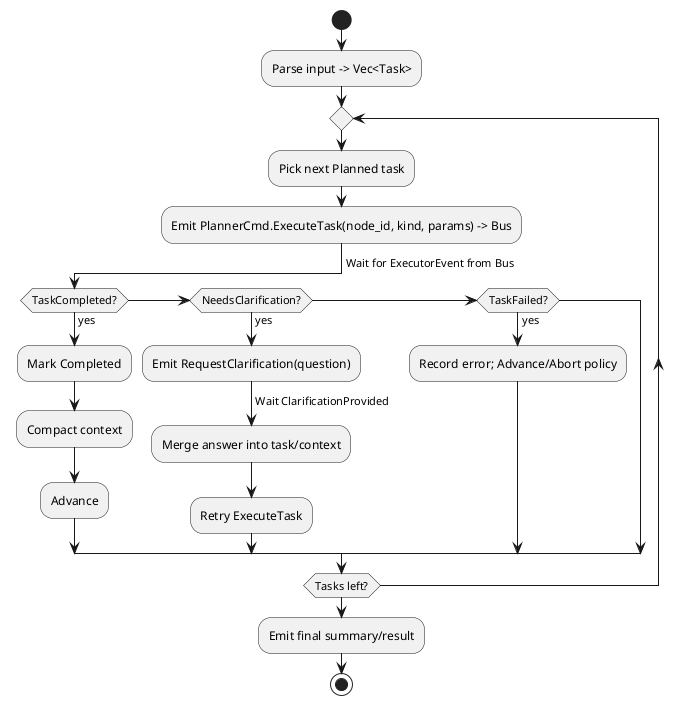

# Event-Sourced Planner — Implementation Design (meta_agent / meta_draft)

**Goal**: Build an event-sourcing‑first planner/executor system with MQ transport and context compaction.

**Core Capabilities**:
- Parse plain text input into executable task sequence
- Execute tasks sequentially via event-driven communication
- Handle clarification requests with pause/resume semantics
- Compact context between steps to manage token limits
- Rebuild state from event log for reliability

**Key Principles**:
- Event Store as single source of truth
- All state changes via domain events
- Idempotent message handling
- Deterministic replay from events

---

## 1) Architecture Overview

### Event-Sourced Foundation
The planner is built on event sourcing from the ground up, following `dabgent_agent` patterns:

**Core Components**:
1. **Event Store**: Append-only log of all domain events (source of truth)
2. **Message Bus**: Async communication between planner and executor via MQ
3. **Outbox Pattern**: Transactional event publishing with retry
4. **Inbox Pattern**: Deduplication and idempotent message processing
5. **Projections**: Rebuild read models (PlannerState) from event stream

**Domain Events** (Core to the system):
```rust
pub enum PlannerDomainEvent {
    // Planning events
    TaskPlanned { task_id: u64, description: String, kind: NodeKind },
    TasksOrdered { task_ids: Vec<u64> },
    
    // Execution events  
    TaskDispatched { task_id: u64, at: Timestamp },
    TaskCompleted { task_id: u64, result_ref: String },
    TaskFailed { task_id: u64, error: String },
    
    // Clarification events
    ClarificationRequested { task_id: u64, question: String },
    ClarificationReceived { task_id: u64, answer: String },
    
    // Context events
    ContextCompacted { summary_ref: String, budget: usize },
}
```

**Message Flow**:
```
User Input → plan_tasks() → TaskPlanned events → Event Store
                                                      ↓
                                              Outbox → MQ Bus
                                                      ↓
Executor consumes → processes → ExecutorEvent → MQ Bus
                                                      ↓
                                   Inbox → step() → New Events
```

**Message Envelope** (All messages on the bus):
```rust
pub struct Envelope {
    pub headers: MessageHeaders {
        event_type: String,
        aggregate_id: String,      // planner instance id
        causation_id: String,       // what caused this event
        correlation_id: String,     // trace across services
        message_id: String,         // unique, for dedup
        timestamp: u64,
        version: u8,
    },
    pub payload: Vec<u8>,          // serialized event
}
```

**Routing & Topics**:
- `planner.cmd.*` - Commands from planner to executor
- `executor.evt.*` - Events from executor to planner  
- `ui.evt.*` - Events from UI (clarifications)

## 2) Public Interfaces & Data Types

> Integrate into `meta_draft/src/actors.rs` (or adjacent module). Enums below extend your existing pipeline types.

```rust
/// Commands emitted by the planner to the executor (published to bus).
pub enum PlannerCmd {
    ExecuteTask { node_id: u64, kind: NodeKind, parameters: String },
    RequestClarification { node_id: u64, question: String },
    // (Optional) Cancel/Abort, SaveCheckpoint, etc.
}

/// Events received by the planner from the executor/UI (consumed from bus).
pub enum ExecutorEvent {
    TaskCompleted { node_id: u64, result: String },
    TaskFailed { node_id: u64, error: String },
    NeedsClarification { node_id: u64, question: String },
    ClarificationProvided { node_id: u64, answer: String },
    // (Optional) CheckpointSaved, ToolOutput, etc.
}

/// Classification for routing & tooling (v1 minimal set)
#[derive(Debug, Clone, Copy)]
pub enum NodeKind {
    Clarification,   // explicit user Q/A
    ToolCall,        // external tool execution
    Processing,      // generic planning/analysis/implementation
}

#[derive(Debug, Clone, Copy, PartialEq, Eq)]
pub enum TaskStatus { Planned, Running, Completed, NeedsClarification }

// (Future)
#[derive(Debug, Clone)]
pub enum AttachmentKind {
    Link(String),        // URL
    ImageRef(String),    // URL or opaque id
    FileRef(String),     // path or opaque id
}

// (Future)
#[derive(Debug, Clone)]
pub struct Attachment {
    pub kind: AttachmentKind,
    pub label: Option<String>,
}

#[derive(Debug, Clone)]
pub struct Task {
    pub id: u64,
    pub description: String,       // plain text step
    pub kind: NodeKind,
    pub status: TaskStatus,
    pub attachments: Vec<Attachment>,
}

#[derive(Debug, Default)]
pub struct PlannerState {
    pub tasks: Vec<Task>,
    pub cursor: usize,
    pub waiting_for_clarification: bool,
    pub pending_clarification_for: Option<u64>,
    pub next_id: u64,
    pub context_summary: String, // compacted rolling summary
}
```

### Planner runtime composition (LLM, Compactor, Event I/O)

```rust
pub struct PlannerConfig {
    pub system_prompt: String,
    pub profile: String, // squeezing profile
}

pub struct Planner<L: LlmClient, C: Compactor, E: EventBus> {
    pub state: PlannerState,
    pub llm: L,
    pub compactor: C,
    pub config: PlannerConfig,
    pub bus: E,
}
```

- The planner owns its own LLM client and a Compactor instance.
- The Compactor is used to summarize/compact results into `context_summary` without naive truncation, respecting a token/character budget.

---

## 3) Control Flow

### Activity (PlantUML)


### Event-Driven Implementation
```rust
impl Planner {
    /// Parse input and emit TaskPlanned events
    pub async fn plan_tasks(&mut self, input: &str) -> Result<()> {
        let tasks = parse_input_to_tasks(input)?;
        
        for task in tasks {
            // Emit domain event (persisted to event store)
            self.emit_event(PlannerDomainEvent::TaskPlanned {
                task_id: task.id,
                description: task.description,
                kind: task.kind,
            }).await?;
        }
        
        // Emit ordering event
        self.emit_event(PlannerDomainEvent::TasksOrdered {
            task_ids: tasks.iter().map(|t| t.id).collect(),
        }).await?;
        
        Ok(())
    }

    /// Process events from inbox and emit new events
    pub async fn step(&mut self, incoming: Option<ExecutorEvent>) -> Result<()> {
        // Process incoming event and emit domain events
        if let Some(evt) = incoming {
            match evt {
                ExecutorEvent::TaskCompleted { node_id, result } => {
                    // Store result externally for large payloads
                    let result_ref = self.store_result(&result).await?;
                    
                    self.emit_event(PlannerDomainEvent::TaskCompleted {
                        task_id: node_id,
                        result_ref,
                    }).await?;
                    
                    // Trigger compaction
                    let summary_ref = self.compact_context(&result).await?;
                    self.emit_event(PlannerDomainEvent::ContextCompacted {
                        summary_ref,
                        budget: self.config.token_budget,
                    }).await?;
                }
                
                ExecutorEvent::NeedsClarification { node_id, question } => {
                    self.emit_event(PlannerDomainEvent::ClarificationRequested {
                        task_id: node_id,
                        question: question.clone(),
                    }).await?;
                    
                    // Publish to UI topic
                    self.bus.publish("ui.clarification.request", 
                        PlannerCmd::RequestClarification { node_id, question }
                    ).await?;
                }
                
                ExecutorEvent::ClarificationProvided { node_id, answer } => {
                    self.emit_event(PlannerDomainEvent::ClarificationReceived {
                        task_id: node_id,
                        answer,
                    }).await?;
                }
                
                ExecutorEvent::TaskFailed { node_id, error } => {
                    self.emit_event(PlannerDomainEvent::TaskFailed {
                        task_id: node_id,
                        error,
                    }).await?;
                }
            }
        }
        
        // Check if we should dispatch next task
        if !self.state.waiting_for_clarification {
            if let Some(next_task_id) = self.get_next_undispatched_task() {
                // Check idempotency - don't dispatch twice
                if !self.is_dispatched(next_task_id) {
                    self.emit_event(PlannerDomainEvent::TaskDispatched {
                        task_id: next_task_id,
                        at: Timestamp::now(),
                    }).await?;
                    
                    // Publish command to executor
                    let task = self.state.get_task(next_task_id)?;
                    self.bus.publish("executor.task.execute",
                        PlannerCmd::ExecuteTask {
                            node_id: task.id,
                            kind: task.kind,
                            parameters: task.description,
                        }
                    ).await?;
                }
            }
        }
        
        Ok(())
    }
    
    /// Emit event to store and outbox
    async fn emit_event(&mut self, event: PlannerDomainEvent) -> Result<()> {
        // Transaction: store event + add to outbox
        self.event_store.append(event.clone()).await?;
        self.outbox.add(event).await?;
        
        // Update local projection immediately
        self.state.apply_event(&event);
        
        Ok(())
    }
}
```

---

## 4) Planning & Attachments

**Parsing strategy (v1, deterministic):**
- Normalize input (trim, collapse whitespace), split into candidate steps by:
  - list bullets/numbered lines
  - sentence boundaries followed by connectors: "then", "next", "and then"
- Classify `NodeKind` with simple rules:
  - command/code/backtick patterns or tool verbs → `ToolCall`
  - explicit questions/ambiguity markers → `Clarification` (or use event flow)
  - otherwise → `Processing`
- Attachments: extract URLs via regex and associate as links; defer images/files.

**Context compaction (v1, no naive truncation):**
- Use a shared `Compactor` abstraction to merge the latest `result` into `context_summary` under a fixed budget.
- Compactor may use the planner's LLM and `system_prompt` to summarize salient details.
- Future prompts include `context_summary` + current task only.

---

## 5) Integration Points

- Create `Planner` (with `PlannerState`, LLM, Compactor) inside `actors.rs` (or `planner.rs` re-exported).
- When new **user input** arrives: build `attachments`, call `plan_tasks`, then call `step(ctx, None)`.
- Transport: MQ bus (see §13). `PlannerCmd` is published; `ExecutorEvent` is consumed from the bus and fed to `step(ctx, Some(evt))`.
- Ensure executor maps `NodeKind` → suitable actor/tool (code agent, test runner, retriever, etc.).

---

## 6) Error & Clarification Policy

- **NeedsClarification** pauses the loop; only resume on `ClarificationProvided`.
- Pause semantics: set `waiting_for_clarification = true` and `pending_clarification_for = Some(node_id)`; `step` returns early until an `ExecutorEvent::ClarificationProvided` is processed for that node.
- **TaskFailed** policy (v1): log, mark failed, continue; (later add retries/backoff).
- Validate attachments exist/accessible before dispatch; if not, ask for re-upload or alt link.

---

## 7) Minimal Example

**Input**: “Add login with session cookies. Use basic auth. Read API spec at https://example.com/spec.pdf. Then write unit tests.”

**Planned tasks** (example):
1. Processing — read spec and extract key constraints.  
2. Processing — backend login.  
3. Processing — frontend form & wiring.  
4. Processing — write and run tests.

If ambiguity (e.g., *cookie expiry?*), emit `RequestClarification` and wait.

---

## 8) Extensibility

See section 11 (Future Work) for planned extensions beyond v1.

---

## 9) Testing

- Unit: parse → tasks mapping; event handling transitions.
- Integration: scripted sequence (Completed → NeedsClarification → ClarificationProvided → Completed).
- Load: long task lists + compaction threshold respected.

---

## 10) Definition of Done

- Enums extended; planner compiles and is called on new input.
- Sequential loop executes tasks; clarification pause/resume works.
- Context compaction active; final summary emitted.
- Basic tests passing (unit + one integration path).

---

## 11) Scope: Not Now (v1)

- Advanced `NodeKind` variants (e.g., `UnitTest`, `Retrieval`, `Analysis`, `Refactor`, `CodeImplementation`).
- Non-URL attachments (image refs, file refs) and parsing of local files.
- Checkpointing, cancellation/abort flows, or persistence of planner state.
- Retries/backoff policies beyond simple log-and-advance on failure.
- Parallel or graph/DAG execution; v1 is strictly sequential.
- LLM-backed planning; v1 uses deterministic parsing heuristics.
- Long-term memory/vector store; v1 uses a rolling compact string summary.
- Rich metrics/telemetry; v1 may include minimal logging only.

---

## 12) Future Work

- Expand `NodeKind` as new tools/agents ship (e.g., `UnitTest`, `Retrieval`, `Analysis`, `Refactor`, `CodeImplementation`).
- Introduce `AttachmentKind` and `Attachment` handling for images and files.
- Add retry policies with caps/backoff and failure classification.
- Checkpoint/save/restore planner state and cancellation support.
- Optional parallelization or partial ordering once executors support it.
- Replace heuristic `plan_tasks` with an LLM-backed planner (same `Task` API).
- Upgrade `context_summary` to a vector store or structured memory.
- Add richer metrics, tracing, and UI affordances for clarifications.

---

## 12) Context Squeezing Integration (from PR #409)

This planner integrates with the shared context squeezing/compaction pipeline to keep prompts within budget while preserving salient information.

Definitions:
- Budget: total token/char limit per prompt section.
- Slots: structured segments that the compactor fills by priority.
- Preservation rules: always-keep items tagged with high priority.
- Metadata tags: per-chunk hints (source, recency, type) to aid scoring.

Planner usage:
- The planner uses a `Compactor` trait to merge `result` into `context_summary` using:
  - `budget_total`: max size for `context_summary`.
  - `slot_weights`: map of slots (e.g., summary, decisions, actions, citations) to weights.
  - `preserve`: list of regexes/ids to always retain (e.g., acceptance criteria, constraints).
- Each task completion produces a `Chunk { text, tags, recency }` that is scored and inserted.
- The compactor de-duplicates, scores, and yields a trimmed `context_summary` without naive truncation.

Prompt assembly:
- Requests constructed as: system_prompt + context_summary + current_task + attachments.
- For `Clarification` tasks, `context_summary` is squeezed to favor open questions and constraints.
- For `ToolCall` tasks, the compactor prioritizes recent tool outputs and parameters.

Extensibility:
- Align slot names and weights with the shared definitions from the squeezing module to ensure consistent behavior across agents.
- If the squeezing module exposes a global profile (e.g., "coding", "analysis"), `PlannerConfig` can select the profile.

---


